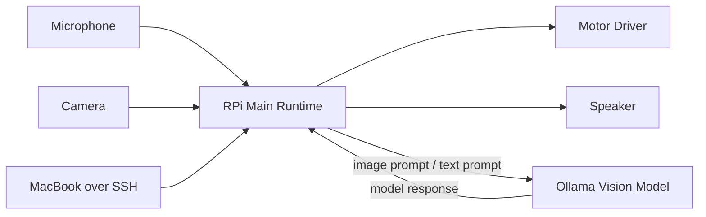

# System Architecture

## High-Level Design

這個系統現在建議採用「Raspberry Pi 主控 + 可選遠端模型」架構：

- `Raspberry Pi 4` 是唯一主程式執行位置，負責拍照、錄音、播放語音、控制馬達、任務狀態與搜尋流程。
- `MacBook` 主要扮演開發操作端，透過 SSH 連線到 Pi 啟動與維護程式。
- 若需要較強的模型推論能力，可讓 `MacBook + Ollama` 作為模型主機，供 Pi 直接呼叫。

這樣的好處是主控權集中在 Pi，不需要再維護一層自訂 FastAPI server。

## Recommended Runtime Flow

## Core Loops

### 1. Voice Mission Loop

1. 使用者對車子說：「請找到玩具。」
2. Raspberry Pi 收音。
3. Raspberry Pi 在本機做 STT，或在初期開發時先用 SSH / CLI 直接輸入文字任務。
4. Pi 將語音內容解析成任務，例如 `find_object: toy`。
5. Pi 在本地建立任務狀態並開始搜尋流程。

### 2. Search Loop

1. RPi 擷取相機畫面，先縮圖，例如 `640x480`。
2. Pi 將圖片與目前任務描述送給 Ollama 模型。
3. 模型回覆判斷結果，例如：
   - 是否看到玩具
   - 玩具在畫面中的大致位置
   - 下一步應該前進、左轉、右轉、停止，或原地搜尋
4. Pi 的決策模組把模型輸出轉成高階動作指令。
5. RPi 轉成 PWM / GPIO 控制馬達。
6. 若尚未找到玩具，持續重複。

### 3. Safety Loop

即使未來加入更多智能功能，也建議保留本地安全機制：

- 模型回應超時就 `stop`
- 收到不合法指令就 `stop`
- 電池電壓過低就 `stop`
- 之後若加入超音波 / ToF 距離感測，可在 Pi 端先做避障

## Responsibility Split

### Raspberry Pi Main Runtime

- Camera capture
- Audio capture / playback
- Motor GPIO control
- Local safety watchdog
- Frame resize / compression
- Mission state machine
- Model adapter
- Search loop orchestration

### MacBook Operator

- SSH remote login
- Start / stop runtime
- Log inspection
- Optional Ollama host

### Core Runtime Types

- Command schemas
- Enum definitions
- Config models
- Error codes

## Design Principles

1. 主程式與安全控制都在 Pi 端，不把控制權交給遠端服務。
2. 所有 AI 決策輸出都要轉成有限集合的動作指令，不要讓模型直接控制 GPIO。
3. 即使是單機主程式，也要保留明確的模組邊界，避免語音、影像、馬達與任務邏輯耦合。
4. 每一層都要能單獨測試：
   - 不接馬達也能測任務流程
   - 沒有模型也能用 mock response
   - 沒有實機也能回放歷史圖片做推論測試

## Configuration Model

這個專案目前採用分層設定模型，讓專案預設值、使用者本地差異和單次測試覆寫可以共存。

優先順序：

1. CLI 參數
2. 環境變數
3. `config/user.toml`
4. `config/defaults.toml`
5. 程式內建 fallback

詳細說明請參考 [configuration.md](/Users/nelsonchung/development/yunxu_raspberry_ai/docs/configuration.md)。

## Model Note

如果你要讓 Ollama 根據圖片判斷玩具位置，必須使用支援 image input 的 vision model。規劃上可把模型層抽象成 `VisionEngine`，這樣未來不論模型跑在 Pi 本機、MacBook 或其他主機，都不用大改主控制流程。
